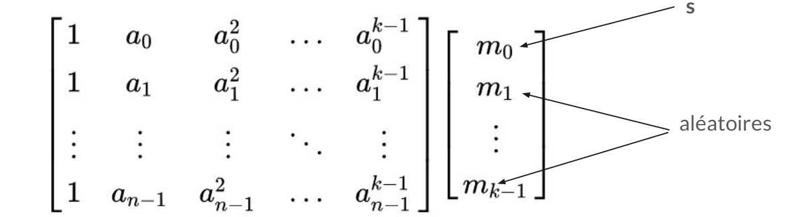

A talk covering the fundamental aspects of how secret sharing schemes work. We primarily explore the connection between Shamir's secret sharing scheme and linear codes, such as Reed-Solomon codes. Finally, we delve into a more complex topic: how to construct such schemes for any abelian group. These types of schemes are often referred to as Black Box Secret Sharing Schemes.

Slides available here :

[📥 Visualize the slides here](how_to_share_a_secret.pdf)

