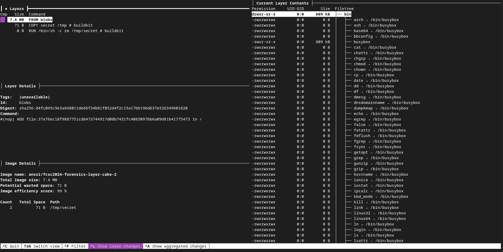
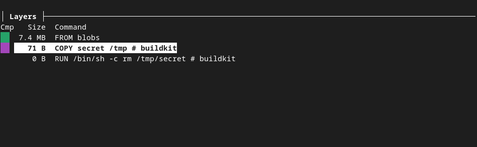
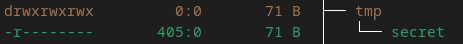

# docker layer write up

You first need to pull all the images : 
```
docker pull anssi/fcsc2024-forensics-layer-cake-1
docker pull anssi/fcsc2024-forensics-layer-cake-2
docker pull anssi/fcsc2024-forensics-layer-cake-3
```

If you type :
```
docker images
...
anssi/fcsc2024-forensics-layer-cake-1   latest       0faa62781dd1   9 months ago   7.38MB
```

you'll be able to see all the images you pulled.


## First layer cake

In docker, layers are the instructions of the Dockerfile used to build the image (they are usually file system changes etc.).
You can easily find this layers by processing the command

```
docker hystory anssi/fcsc2024-forensics-layer-cake-1 --no-trunc

IMAGE                                                                     CREATED        CREATED BY                                                                                          SIZE      COMMENT
sha256:0faa62781dd1db0ebb6cd83836bb4ba24f8b58b0cd761ac0cbae426bccc7666f   1 months ago   CMD ["/bin/sh"]                                                                                     0B        buildkit.dockerfile.v0
<missing>                                                                 1 months ago   USER guest                                                                                          0B        buildkit.dockerfile.v0
<missing>                                                                 1 months ago   ARG FIRST_FLAG=FCSC{a1240d90ebeed7c6c422969ee52xxxxxxxxxxxxxxxxxxxxxxxxxxxxxxxxxxxxx}               0B        buildkit.dockerfile.v0
<missing>                                                                 1 months ago   /bin/sh -c #(nop)  CMD ["/bin/sh"]                                                                  0B        
<missing>                                                                 1 months ago   /bin/sh -c #(nop) ADD file:37a76ec18f9887751cd8473744917d08b7431fc4085097bb6a09d81b41775473 in /    7.38MB 
```

so here's our first flag :) !

## Second layer cake

If you retry the same command as in the first challenge, you'll see something close to that :

```
IMAGE                                                                     CREATED        CREATED BY                                                                                          SIZE      COMMENT
sha256:03014d9fc4801b1810b112fd53e05e35ea127e55c82d1304b5622cfe257c0ad8   1 months ago   CMD ["/bin/sh"]                                                                                     0B        buildkit.dockerfile.v0
<missing>                                                                 1 months ago   USER guest                                                                                          0B        buildkit.dockerfile.v0
<missing>                                                                 1 months ago   RUN /bin/sh -c rm /tmp/secret # buildkit                                                            0B        buildkit.dockerfile.v0
<missing>                                                                 1 months ago   COPY secret /tmp # buildkit                                                                         71B       buildkit.dockerfile.v0
<missing>                                                                 1 months ago   /bin/sh -c #(nop)  CMD ["/bin/sh"]                                                                  0B        
<missing>                                                                 1 months ago   /bin/sh -c #(nop) ADD file:37a76ec18f9887751cd8473744917d08b7431fc4085097bb6a09d81b41775473 in /    7.38MB 
```

As we can see, a secret has been copied in the /tmp folder but we can't access it only with this command. No we will need to "dive" further into the file system of each layer. To do so,
we can use the tool dive :




As we can see, we can navigate through the layers of the image consulting the structure of the file system. From here, we can see that a file named secret has been placed into the /tmp folder.





Now the goal is to extract that file ! Let us inspect the image with `docker inspect`. The interesting field is `GraphDriver.Data.LowerDir` which list the folder containing the difference of the file system of all older layers.

Seeing this :

```
"Data": {
                "LowerDir": "/var/lib/docker/overlay2/643b1a02362f1cef26f01cc94c3b9a0ee5fb8b429ce3b1511194b9cf0a7bd1b2/diff:/var/lib/docker/overlay2/fbbfa9fff3f5a67da15ef066aa4c83066a02ddebab95de67c6b47bddf2fe05d3/diff",
```

we can deduce that the file system difference is located in the `` folder, and cat the secret :

```
root@MathieuDebian:/var/lib/docker/overlay2/643b1a02362f1cef26f01cc94c3b9a0ee5fb8b429ce3b1511194b9cf0a7bd1b2/diff/tmp# pwd
/var/lib/docker/overlay2/643b1a02362f1cef26f01cc94c3b9a0ee5fb8b429ce3b1511194b9cf0a7bd1b2/diff/tmp
root@MathieuDebian:/var/lib/docker/overlay2/643b1a02362f1cef26f01cc94c3b9a0ee5fb8b429ce3b1511194b9cf0a7bd1b2/diff/tmp# cat secret 
FCSC{b38095916b2b578109cbf35b8be713b04a64b2b2dxxxxxxxxxxxxxxxxxxxxxxxx}
```

Here's the second flag !


## third layer cake

Again, let's pull and inspect our image. We can see this line indicating the folder where all the data related to the docker image is stored.

```
"UpperDir": "/var/lib/docker/overlay2/eea95c7208f138a8c449ecbbfc64874d130f20e8a3239a389aaa69c4df797974/diff"
```

let's get into this folder and execute the command 

```
root@MathieuDebian:/var/lib/docker/overlay2/eea95c7208f138a8c449ecbbfc64874d130f20e8a3239a389aaa69c4df797974/diff# grep -r FCSC{
nix/store/m8ww0n3iqndg8zaiwbsnij6rvmpmjbry-hello/bin/hello:exec /nix/store/rnxji3jf6fb0nx2v0svdqpj9ml53gyqh-hello-2.12.1/bin/hello -g "FCSC{c12d9a48f1635354fe9c32b216f144ac66f7b8466a5ac82a35aa385964ccbb61}" -t
```

Once again, here's the flag !
