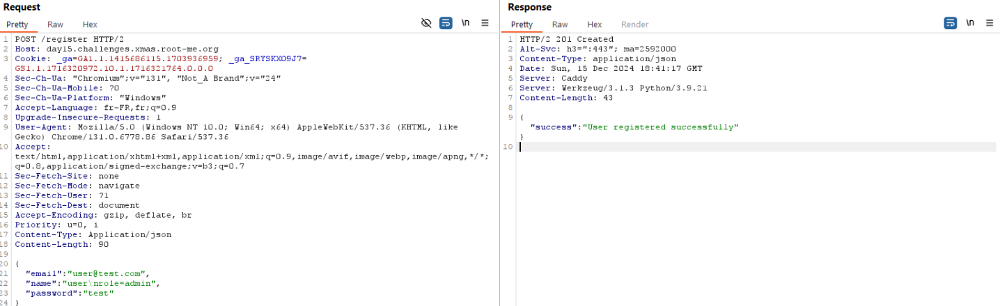
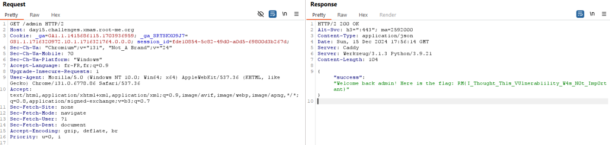

### New new .. always new

We first land on a page that provides the application code. Let's download it and read it. The application is quite simple :

- One register route which create and store an user :

```python
email = request.json.get('email')
name = request.json.get('name')
password = request.json.get('password')
password_hash = generate_password_hash(password)
user = User(email=email, name=name, role='user', password_hash=password_hash)
db.session.add(user)
db.session.commit()
```

* One login route that checks if the user exists and creates and creates a session cookie using an uuidV4 
```python
email = request.json.get('email')
password = request.json.get('password')
user = User.query.filter_by(email=email).first()
if user and check_password_hash(user.password_hash, password):
	session_id = create_session(user.email, user.name, user.role)
	response = make_response(jsonify(success="Logged in successfully"))
	response.set_cookie('session_id', session_id)
return response
```

The `create_session` method is used to create a file storing informations about the current user named session_{uuid}.conf.

```python
def create_session(email, name, role):
	session_id = str(uuid.uuid4())
	session_file = os.path.join(SESSION_DIR, f'session_{session_id}.conf')
	with open(session_file, 'w') as f:
		f.write(f'email={email}\n')
		f.write(f'role={role}\n')
		f.write(f'name={name}\n')
	return session_id
```

* The admin route that check the file created before during the `create_session` method and read the role to ensure that only the admin is accessing the file. Here is the `load_session` method that read properties written in the local file :

```python
session_data = {}
with open(session_file, 'r') as f:
	for line in f:
		key, value = line.strip().split('=')
		session_data[key] = value
```

### Vulnerability :

In this function, every single line is read. The goal is to overwrite the 'role' of the user (mass assignment) via an "injection of properties". To do so, we need to create a user with the following request :



Since we already know that the name is written after the role in the file, the configuration file should like this 

```
email=user@test.com
role=user
name=user
role=admin
```

Then, when the `load_session` function is called, the role will first be set to 'user' and then set to 'admin'. 

Now you just need to access to the /admin route and read the flag :



`RM{I_Thought_Th1s_VUlnerab1ility_W4s_N0t_Imp0rtant}`
