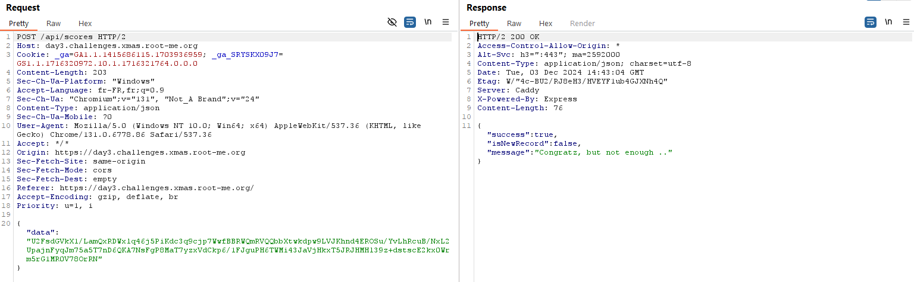
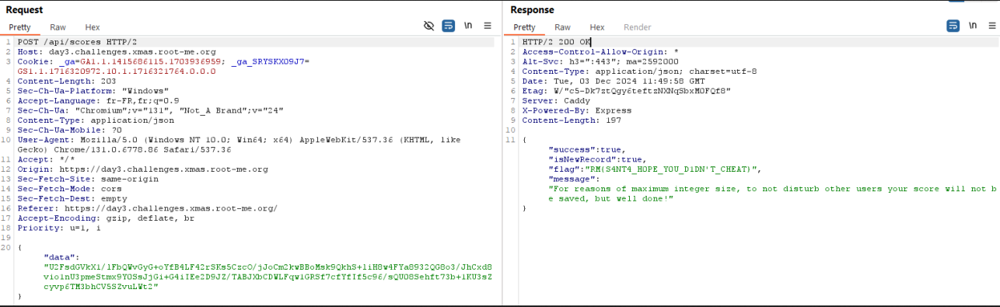

### Santa's magick sack

Le site propose un jeu interractif ou le but est d'amasser le plus de point en attrapant les cadeaux qui tombe. Le but du jeu est de battre le jouer "Santa" qui a un score de ... points.

Bien évidemment c'est impossible sans tricher !

L'application fonctionne avec du javascript local. A la fin du jeu, l'application envoie une requête à l'endpoint **/score** à l'aide d'une requête **POST** :



A première vu, la chaine semblait être encodée en base64 mais celle-ci n'est pas lisible lorsqu'on la décode. Allons du côté de code source JavaScript quand la requête est envoyée :

```JS
var Md = hf.exports;
const gf = Rf(Md),
    Ud = "S4NT4_S3CR3T_K3Y_T0_ENCRYPT_DATA";

function Wd(e) {
    const t = JSON.stringify(e);
    return gf.AES.encrypt(t, Ud).toString()
}
function $d(e, t) {
    const r = Math.floor(Math.random() * 9) + 1,
        n = `${e}-${t}-${r}`;
    return {
        checksum: gf.SHA256(n).toString(),
        salt: r
    }
}
async function Vd(e, t) {
    const {
        checksum: r,
        salt: n
    } = $d(e, t),
        l = Wd({
            playerName: e,
            score: t,
            checksum: r,
            salt: n
        });
    try {
        return await (
            await fetch("/api/scores", {
                method: "POST",
                headers: {
                    "Content-Type": "application/json"
                },
                body: JSON.stringify({
                    data: l
                })
            })).json()
    } catch (i) {
        return console.error("Error submitting score:", i), {
            success: !1
        }
    }
}
```

Dans l'application, le payload est donc envoyé sous cette forme :
```JSON
{
  playerName: 'sidorocs',
  score: 150,
  checksum: '728282e9a412663db774ffd0ca82877f03449c6ff84781b685a7c58de862e4c0',
  salt: 3
}
```
 et chiffré avec AES 256 grâce à la clé `S4NT4_S3CR3T_K3Y_T0_ENCRYPT_DATA`.

De plus, la somme de contrôle n'est ni plus ni moins que le hash SHA256 de la chaine de charactère suivante : 
```JS
`${playerName}-${score}-${randomSalt}`
```

En sachant tout ça, il est possible de rejouer le code de génération du payload en changeant le score et enfin de rejouer la requête **POST** qui envoie le score au backend de l'application : 



And here's the flag :) `RM{S4NT4_H0PE_Y0U_D1DN'T_CHEAT}`
